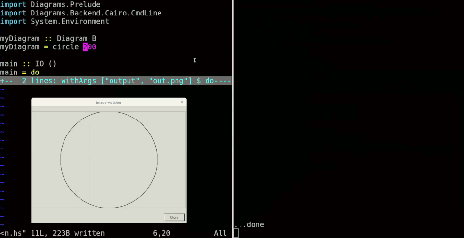

# image-watcher

Display an image and update it when the file changes.

```
$ image-watcher --help
Usage: image-watcher FILE
  Display an image and update it when the file changes

Available options:
  FILE                     Image file to watch and display
  -h,--help                Show this help text
```

Especially useful in combination with a program like [ghcid](https://hackage.haskell.org/package/ghcid) or [fswatcher](https://hackage.haskell.org/package/fswatcher) which runs a command when your code changes. Write a function which renders your image description to a file, and configure that program to run that function whenever you edit that image description. Tada! You now have a live preview for that image description.


